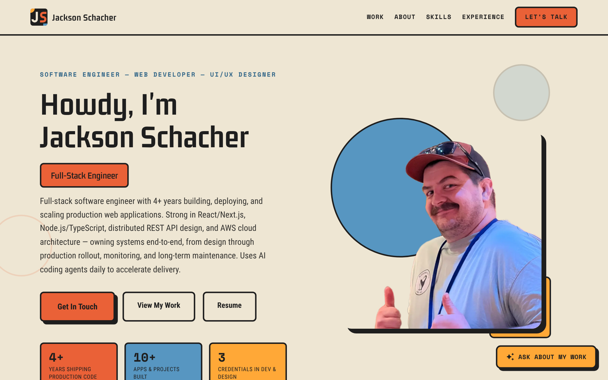
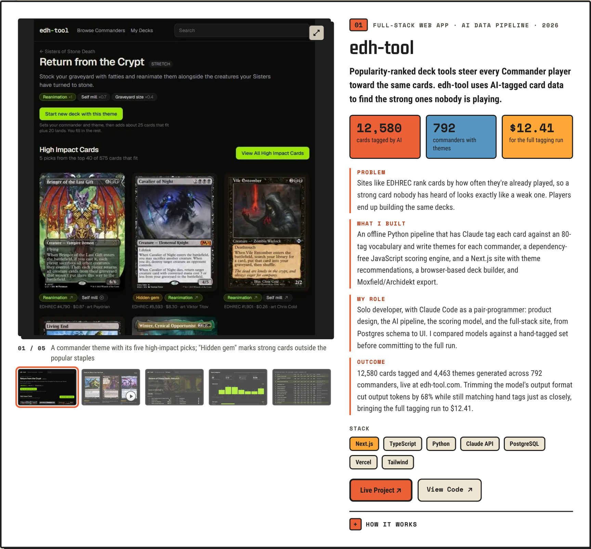
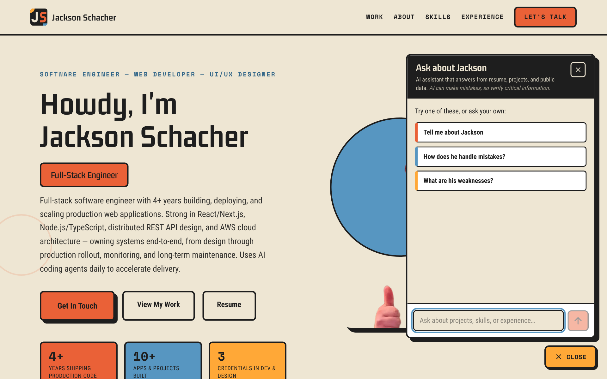
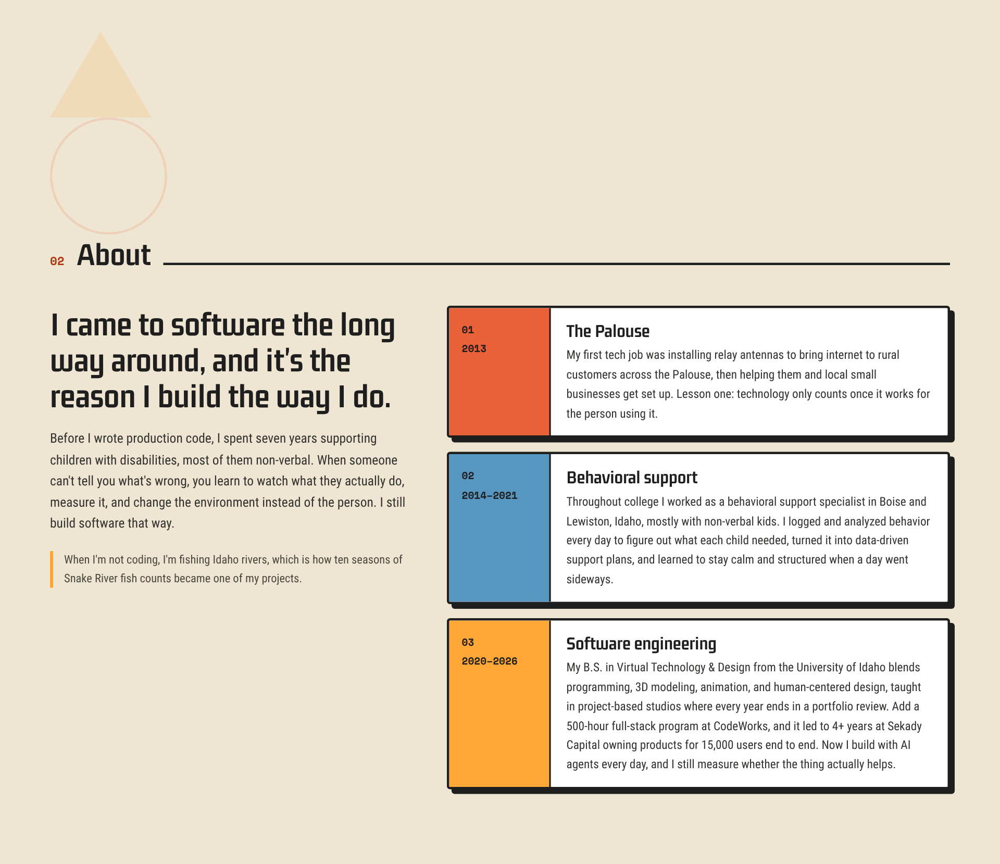
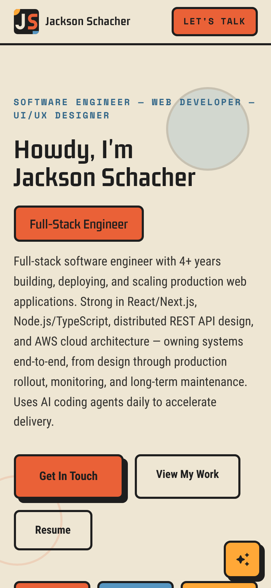
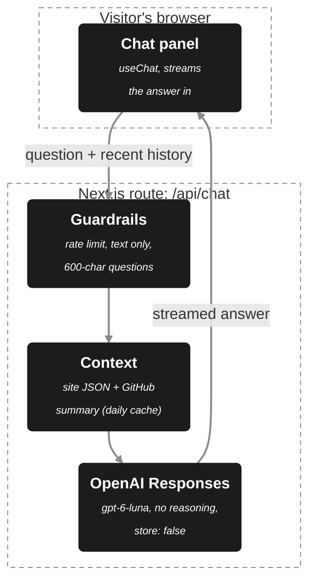

# jackson-schacher.com

My portfolio site: a single-page Next.js app that makes the case for hiring me as a full-stack engineer and UI/UX designer. Visitors get case studies built around the problem, my role and measurable results, a short story of how I came to software, and an **AI assistant that answers recruiters' questions about my work**, grounded in my resume, case studies and public GitHub.

**Live:** [jackson-schacher.com](https://jackson-schacher.com)



## At a glance

- **Case studies built for skimming:** each project leads with the problem it solved, then three metric tiles, then Problem / What I built / My role / Outcome in a line or two each, with the deeper engineering story tucked behind "How it works".
- **Media first:** every case study gets a large gallery of screenshots and looping clips that only play while on screen. TradingApp's GIFs were converted to WebM, going from 7.5 MB to 1.1 MB.
- **An AI assistant with guardrails:** a streaming chat (OpenAI `gpt-6-luna` via the Vercel AI SDK) that answers only from the site's own content plus a daily-cached GitHub summary, with input caps, a per-visitor rate limit, and response storage turned off.
- **Answers in my own words:** behavioral questions ("How does he handle mistakes?", "What are his weaknesses?") are answered from STAR stories I wrote, and the assistant maps reworded questions to the closest one.
- **One content source:** all copy lives in JSON files. The page and the assistant both read them, so editing a project updates both.
- **A small design system:** Bauhaus-style tokens (three accents, flat offset shadows, thick ink borders), scroll reveals in pure CSS, and reduced-motion support throughout.
- **AI-assisted, human-directed:** built with Claude Code as a pair-programmer. See [My role and how I used AI](#my-role-and-how-i-used-ai).

## Why I built it

A resume says what I did; it can't show it, and recruiters skim. I wanted a site where the first line of every project lands on its own, the visuals do most of the talking, and a visitor with a specific question gets a specific answer right away instead of hunting through pages. The assistant had to be honest: no invented skills, no salary guesses, and a clear "I don't know, email Jackson" when the material doesn't cover something.

## Tour

**Selected Work.** Each case study pairs a gallery with the copy. Thumbnails swap the stage, clips loop muted while visible, and images open full size.



**Ask about my work.** A floating assistant with three recruiter-style starter questions. It says up front that it's AI and can make mistakes.



**About.** Three chapters: installing rural internet across the Palouse, seven years supporting non-verbal kids in behavioral support, then software. The thread through all three is the loop I still build by: watch what people actually do, measure it, change the system.



**On a phone.** The nav collapses to one row, case studies stack media-first, and the assistant opens as a bottom sheet.



## How the assistant works



### The central decision: answer only from material I control

The system prompt is assembled from the same JSON files the page renders: projects, experience, expertise, skills, the About story, and my own interview answers. A summary of my public GitHub repos is added as clearly labeled background. The model is told to use only those facts, speak about me in the third person, keep answers short, and say so when it's piecing an answer together rather than quoting one.

What that buys:

- **It can't drift out of date.** Edit a project in `projectsData.json` and the next deploy updates both the card and the assistant.
- **It doesn't invent.** No employers, numbers, skills or weaknesses that aren't in the material. On salary it gives only my stated answer and never a number.
- **It still bridges gaps.** "Tell me about a time he failed" maps to my mistakes story; "How does he learn new tech?" can draw on the C# story plus the projects. It frames those answers as inferred.
- **It stays on topic.** Requests for general coding help or anything unrelated get a one-line decline, and it's told to ignore instructions hidden in a visitor's message or a README.

### Guardrails, since this is a public endpoint on my own bill

- **Input caps:** text-only messages, 600 characters per question, the last 12 messages, and older history trimmed to a character budget instead of rejecting long conversations.
- **Output cap:** 450 tokens, with reasoning effort set to `none` so answers start fast and stay cheap (a fraction of a cent per question).
- **Rate limit:** 15 questions per visitor per 10 minutes. It's in memory, so it's per server instance; a shared store would be the next step if traffic called for it.
- **Privacy:** `store: false`, so visitors' questions aren't kept on the OpenAI account.
- **The key itself** lives only on the server, in an OpenAI project restricted to the Responses endpoint and one model, with a monthly budget cap.

### GitHub context

`app/lib/githubContext.ts` takes my 10 most recently pushed non-fork public repos from the last three years and keeps each one's description, main language, last push and a trimmed README excerpt. Unedited starter-template READMEs are skipped, so the assistant never credits me with a template's features. The result is cached for a day, and if GitHub is slow or down the assistant simply answers without it.

### Other design decisions

- **Recruiter-skim copy order.** Every case study follows the same shape (hook, three metrics, problem, what I built, my role, outcome, stack), so a reader comparing projects always finds the same information in the same place.
- **The gallery is a small client component.** Sections render on the server; only the nav, hero, experience tabs, gallery and chat run in the browser.
- **Scroll reveals in pure CSS.** `animation-timeline: view()` drives the reveals with no JavaScript or observers. Browsers without it, and visitors who prefer reduced motion, get static content.
- **Tokens instead of hex values.** `src/tokens.ts` holds the colors, borders, flat offset shadows and type aliases. The bright orange and blue fail WCAG AA as small text on the cream background, so small text uses darker variants.
- **Real link previews.** A 1200×630 Open Graph image in the site's style, so a link shared on LinkedIn or Slack looks intentional.

## Quality checks

There's no automated test suite yet. Before each deploy:

```bash
npx tsc --noEmit   # type check
npm run lint       # ESLint (core-web-vitals + TypeScript rules)
npm run build      # production build, the final gate
```

During the latest redesign, automated browser checks also ran at desktop and phone widths: full-page screenshots, console errors, broken images, horizontal overflow, missing alt text, unnamed buttons, heading order and tap-target sizes. They caught a 1px horizontal scroll on phones, nav links with 20px tap targets, and a mobile nav that wrapped to three rows. All three are fixed.

The chat route was exercised directly: malformed requests, oversized questions, long histories and the rate limit all return the right status and a friendly message.

## Running it

**Requirements:** Node.js 20.9 or newer.

```bash
npm install
npm run dev        # http://localhost:3000
```

The site works without any configuration. The assistant needs an OpenAI key; without one it shows a "chat is offline" message. Create `.env.local`:

```bash
OPENAI_API_KEY=sk-...             # required for the assistant
PORTFOLIO_CHAT_MODEL=gpt-6-luna   # optional, this is the default
PORTFOLIO_CHAT_REASONING=none     # optional: none | low | medium | high
GITHUB_TOKEN=...                  # optional, only raises GitHub's rate limit
NEXT_PUBLIC_BOOKING_URL=...       # optional: shows a "Book a 15-min call" button
```

### Deploying on AWS Amplify

Amplify only exposes console environment variables to Next.js server routes if the build writes them to `.env.production`, so the build phase in `amplify.yml` needs one extra line:

```yaml
build:
  commands:
    - env | grep -e OPENAI_API_KEY -e PORTFOLIO_CHAT_ -e GITHUB_TOKEN >> .env.production
    - npm run build
```

## Editing content

All copy is JSON in [`app/data/`](app/data). Edit it, and both the page and the assistant pick it up.

| File | What it holds |
| --- | --- |
| [`projectsData.json`](app/data/projectsData.json) | Case studies: hook, metrics, problem/built/role/outcome, stack, "How it works" details, gallery media |
| [`aboutData.json`](app/data/aboutData.json) | The About lead, intro, three career chapters and closing line |
| [`experienceData.json`](app/data/experienceData.json) | Work history and education for the Experience tabs |
| [`featuresData.json`](app/data/featuresData.json) | Core Expertise cards |
| [`skillIconData.json`](app/data/skillIconData.json) | Toolkit chips, grouped by category, with icon file names |
| [`contactIconData.json`](app/data/contactIconData.json) | Contact links |
| [`workingStyleData.json`](app/data/workingStyleData.json) | My answers to interview questions. Story questions use STAR (`summary` + `star.situation/task/action/result`); the rest use a plain `answer` |
| [`archivedProjectsData.json`](app/data/archivedProjectsData.json) | Retired case studies in the old format. Nothing imports it |

Gallery media lives in `public/projects/<project>-media/`. Each entry needs its real pixel `width` and `height`, and videos need a `poster`. The first item sets the gallery's aspect ratio.

## Project layout

| File | What it is |
| --- | --- |
| [`app/page.tsx`](app/page.tsx) | The single page: hero, then sections 01–06, then the assistant |
| [`app/layout.tsx`](app/layout.tsx) | Metadata, Open Graph, theme, fonts, skip link, nav |
| [`app/components/projectsCard.tsx`](app/components/projectsCard.tsx), [`projectGallery.tsx`](app/components/projectGallery.tsx) | Selected Work case studies and their media gallery |
| [`app/components/portfolioChat.tsx`](app/components/portfolioChat.tsx) | The assistant: launcher, panel, suggestions, streaming messages |
| [`app/api/chat/route.ts`](app/api/chat/route.ts) | The assistant's endpoint: validation, rate limit, OpenAI call |
| [`app/lib/portfolioContext.ts`](app/lib/portfolioContext.ts) | Builds the system prompt and its rules from the content JSON |
| [`app/lib/githubContext.ts`](app/lib/githubContext.ts) | Daily-cached summary of public GitHub repos |
| [`app/components/`](app/components) | The other sections: hero, About, expertise, toolkit, experience, contact, nav |
| [`src/tokens.ts`](src/tokens.ts), [`src/theme.tsx`](src/theme.tsx), [`src/fonts.ts`](src/fonts.ts) | Design tokens, the MUI theme, and fonts (Gemunu Libre, Roboto Condensed, Space Mono) |
| [`CLAUDE.md`](CLAUDE.md) | Conventions for AI-assisted changes to this repo |

**Stack:** Next.js 16 (App Router), React 19, TypeScript, MUI 9 with Emotion, the Vercel AI SDK 6 with the OpenAI provider, hosted on AWS Amplify.

## My role and how I used AI

I built this solo with [Claude Code](https://claude.com/claude-code) as a pair-programmer. In the latest redesign it wrote most of the first drafts (the case-study layout, the assistant and this README), and it drove the screenshot capture and browser checks. The direction, the content and the final calls were mine.

**What I brought**

- **Positioning and content.** I aligned the site with my resume, chose which projects to feature and which to retire, and wrote the About story and my interview answers. When a draft didn't read right on the page, like the first set of hero stats or an availability badge at the top, I sent it back.
- **What the assistant may and may not do.** I chose to answer from my own material only, wanted behavioral questions answered from STAR stories in my voice, and set the rules for gaps: bridge them from real facts, never invent.
- **Cost and security decisions.** I moved the assistant to my own OpenAI account and set the key up with only the permission it needs, a single allowed model and a monthly budget.
- **Design and UX direction.** I asked for more prominent media and a recruiter-skim case-study format (lead with the problem, state the stack and my role, quantify the outcome), and picked the assistant's starter questions.

**Where Claude Code helped**

- First drafts of the case-study layout, gallery, About section, chat panel and API route, which I reviewed, ran and adjusted.
- Researching current model pricing and Amplify's environment-variable behavior.
- Capturing media: stitching screenshots of edh-tool.com from the in-app browser, and converting TradingApp's GIFs to WebM.
- Audits that caught the layout issues listed under [Quality checks](#quality-checks).

## Limitations and next steps

- **No automated tests.** Next: unit tests for the chat route's input handling and the prompt builder, and a Playwright smoke test of the page and the chat panel.
- **The rate limit is per server instance.** Fine at portfolio traffic. Next, if needed: a shared store such as Upstash.
- **The assistant can be wrong.** The panel says so, and the prompt keeps it to provided facts, but it's still a language model.
- **Some screenshots are soft.** The edh-tool captures are 800px wide, limited by the browser that took them.
- **LinkedIn isn't connected.** LinkedIn's API doesn't expose work history, so the next step is adding recommendations from a LinkedIn data export as quotes the assistant can use.

## Acknowledgements

- **Icons:** [Material Design Icons](https://pictogrammers.com/library/mdi/) (Apache 2.0), [Simple Icons](https://simpleicons.org) (CC0) and [Devicon](https://devicon.dev) (MIT). Logos and product names belong to their owners.
- **Fonts:** Gemunu Libre, Roboto Condensed and Space Mono from Google Fonts (SIL Open Font License).
- **Project media:** screenshots of my own projects. Magic: The Gathering card images in the edh-tool screenshots are © Wizards of the Coast; edh-tool is unofficial Fan Content permitted under the Fan Content Policy. Salmon passage data in the Salmonid project comes from Columbia Basin Research DART.

## License

© 2026 Jackson Schacher. All rights reserved. The code is public to read as a portfolio piece; no license to reuse it is granted.
